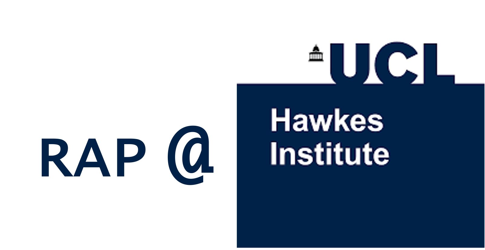

# RAP @ Hawkes
https://github.com/sophmrtn/rap_hawkes_ucl/blob/main/README.md

This repository contains resources and materials for the Reproducible Analytical Pipelines (RAP) workshop series at the UCL Hawkes Institute. This series aims to promote good software engineering practices to enable collaboration between researchers across the Institute.

General links and useful resources can be found in the `resources` folder.

### **Workshop content & structure**
The series will include 10 hybrid workshops over the 2025-26 academic year.

| Session | Topic | Summary |
| :--- | :--- | :--- |
| 1 | Introduction & Python best practices | Tips and tricks on managing Python projects. |
| 2 | Cluster computing | How to efficiently utilise HPC resources + ask the experts! |
| 3 | GitHub | Managing repositories |
| 4 | | |
| 5 | | |
| 6 | | |
| 7 | | |
| 8 | | |
| 9 | | |
| 10 | | |

Exercises and code related to each session can be found in the `sessions` folder.

---

### **Getting Started**

To run the code and exercises from this workshop, you will need the following prerequisites installed on your machine:

1.  **Software:**
    * **[Python]** (Version: **[e.g., 4.2.0 or 3.10]**)
    * **[An IDE]** (We recommend Visual Studio Code)
    * **Git**
